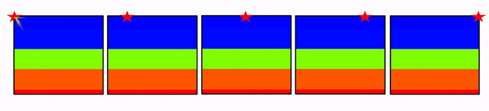

# <p align="center">Physics-Informed Deep Learning for Geological Full Waveform Inversion (FWI)</p>

__*<p align="center">Girish Krishnan, Ryan Irwandy, Yash Puneet, Harini Gurusankar</p>*__

*<p align="center">ECE 228 Final Project, Spring 2025</p>*

|||
|---|---|

||
|---|

__<p align="center"><a href="https://docs.google.com/presentation/d/1wfly51wmukF_M-mXVlJaRHG03IYZg2LK1fLiKip6Jt8/edit?usp=sharing" target="_blank">
      Click here to view our poster!
   </a></p>__

---

## Directory Structure

```plaintext
ECE-228-Final-Project/
├── media
├── project_proposal
├── project_report
├── models
   ├── FNO_2D
   ├── FourierDeepONet
   ├── InversionNet
   ├── NeuralODE
   ├── PCA
   ├── ResidualUNet
   ├── VelocityGAN
├── kaggle
├── data_loading.py
```

The `models` directory contains several subdirectories, one for each model used in the project. Each subdirectory contains a `README.md` file that in turn contains a description of the model, its architecture, and how to run it.

The `kaggle` directory contains the code that can be used to make submissions to the Kaggle competition.

---

## Software Setup and Installation

This is describes the software setup used by our team for the project. It is recommended to use a virtual environment to avoid conflicts with other Python packages.

- OS: Ubuntu 20.04+ or macOS (tested on both)
- Python: 3.10+
- CUDA: 11.8 (for GPU support)
  - You could also the the MPS on an M1/M2 Mac, but we recommend using a GPU for faster training.
- GPU: At least 8 GB VRAM recommended
- Disk: If you want to work with our small subset of the OpenFWI dataset, you will need at least 5 GB of free disk space. If you want to work with the full OpenFWI dataset, you will need at least 625 GB of free disk space.

**Step 1:** To get started, clone this repository and install the required packages:

```bash
git clone https://github.com/Girish-Krishnan/ECE-228-Final-Project.git
```

**Step 2:** Then, create a virtual environment, activate it, and install the required packages using the `requirements.txt` file provided in the root directory:

```bash
python3 -m venv fwi-env
source fwi-env/bin/activate
pip install -r requirements.txt
```

If running on GPU, install PyTorch with CUDA:

```bash
pip install torch torchvision torchaudio --index-url https://download.pytorch.org/whl/cu118
```

---

## Downloading the Dataset

### Working with a Small Subset of the OpenFWI Dataset

To start off, you can download a small sample of the OpenFWI dataset at this link: [OpenFWI Sample Dataset](https://drive.google.com/drive/folders/1xN6Bc58ifY488msIMvQG5F8SZPz7YZrr?usp=sharing). This is ~3 GB and contains a **small representative subset** of the OpenFWI dataset, designed for quick prototyping and testing of seismic imaging models. The data includes seismic waveform recordings (**inputs**) and velocity maps (**ground truth targets**) across three dataset families: Vel, Fault, and Style.

Here is the directory structure of the small dataset:

```plaintext
small_dataset/
├── CurveFault_A/
│   ├── seis2_1_0.npy       # Seismic data (Fault family)
│   └── vel2_1_0.npy        # Velocity map (Fault family)
├── FlatVel_A/
│   ├── data/
│   │   └── data1.npy       # Seismic data (Vel family)
│   └── model/
│       └── model1.npy      # Velocity map (Vel family)
├── FlatFault_A/
│   ├── seis2_1_0.npy       # Seismic data (Fault family)
│   └── vel2_1_0.npy        # Velocity map (Fault family)
├── Style_A/
│   ├── data/
│   │   └── data1.npy       # Seismic data (Style family)
│   └── model/
│       └── model1.npy      # Velocity map (Style family)
```

Here is a brief overview of the dataset families:

- **Seismic Data** (`data/*.npy` or `seis_*.npy`):
  4D NumPy arrays of shape `(batch_size, num_sources, time_steps, num_receivers)`
  - These serve as the **model input**.
  - Represent wave recordings over time from different sources and receivers.

- **Velocity Maps** (`model/*.npy` or `vel_*.npy`):
  3D NumPy arrays of shape `(batch_size, height, width)`
  - These are the **prediction targets**.
  - Represent subsurface velocity distributions (in km/s) used as ground truth.


For each seismic data sample, the goal is to predict the corresponding velocity map:
- Example pairs:
  - `FlatVel_A/data/data1.npy` → `FlatVel_A/model/model1.npy`
  - `CurveFault_A/seis2_1_0.npy` → `CurveFault_A/vel2_1_0.npy`
  - `FlatFault_A/seis2_1_0.npy` → `FlatFault_A/vel2_1_0.npy`
  - `Style_A/data/data1.npy` → `Style_A/model/model1.npy`

#### How to Use the Small Dataset

1. **Load and visualize a sample:**

   Run the provided `data_loading.py` script to visualize a selected sample:

   ```bash
   python data_loading.py
   ```

   This will display:
   - A velocity map (color plot)
   - Seismic waveforms for five source channels (grayscale plots)

2. **Modify the script:**

   You can change the file paths or the `sample_idx` inside `data_loading.py` to explore other samples or families.

3. **Integrate into models:**

   Use the loaded NumPy arrays as input and output data for training deep learning models:
   - Input: 3D seismic data
   - Output: Predicted 2D velocity map

### Working with the Full OpenFWI Dataset

For full-scale training, you can access the complete OpenFWI dataset on Hugging Face: [OpenFWI Dataset](https://huggingface.co/datasets/samitizerxu/openfwi). This dataset is significantly larger (over 600 GB) and contains a wide variety of seismic data and velocity maps across multiple families. This dataset is also organized in a similar structure to the small subset explained above. 

Note that the Kimberlina family is excluded here as it is not relevant for seismic imaging tasks in this competition.

---

## Example Training Script on Small Dataset

To train a basic CNN model involving 3D convolutional layers, you can use the following example script. This script assumes you have the small dataset downloaded and organized as described above.

```bash
python training_example.py
```

This script will:
- Load the small dataset from the specified directory.
- Preprocess the data (normalization, reshaping).
- Define a simple CNN model with 3D convolutional layers.
- Train the model on the seismic data to predict velocity maps.
- Show some visualizations of the resulting predictions after the training is complete.

---

## Running the Code for Each Model

Each model in the `models` directory has its own `README.md` file that provides instructions on how to run the code for that specific model. 

Please open the `models` directory and navigate to the subdirectory of the model you are interested in. Each subdirectory contains:
- A `README.md` file with instructions on how to run the model.
- The model code itself, which can be run using the provided scripts.
For example, to run the FourierDeepONet model, you would navigate to the `models/FourierDeepONet` directory and follow the instructions in the `README.md` file there.

---

## Submitting to Kaggle

To submit your predictions to the Kaggle competition, you can use the code provided in the `kaggle` directory. This code will help you format your predictions and create a submission file that can be uploaded to the Kaggle competition page.

Make sure to follow the instructions in the `kaggle/README.md` file to prepare your submission correctly.