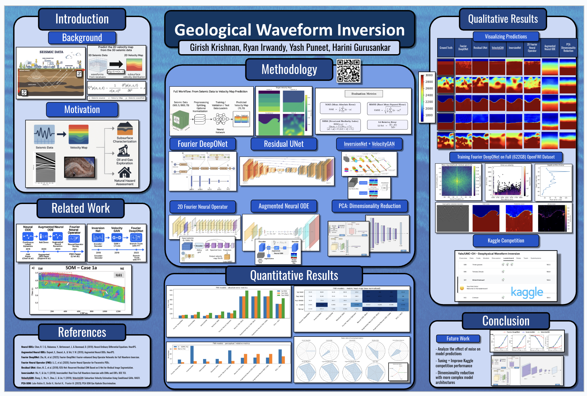
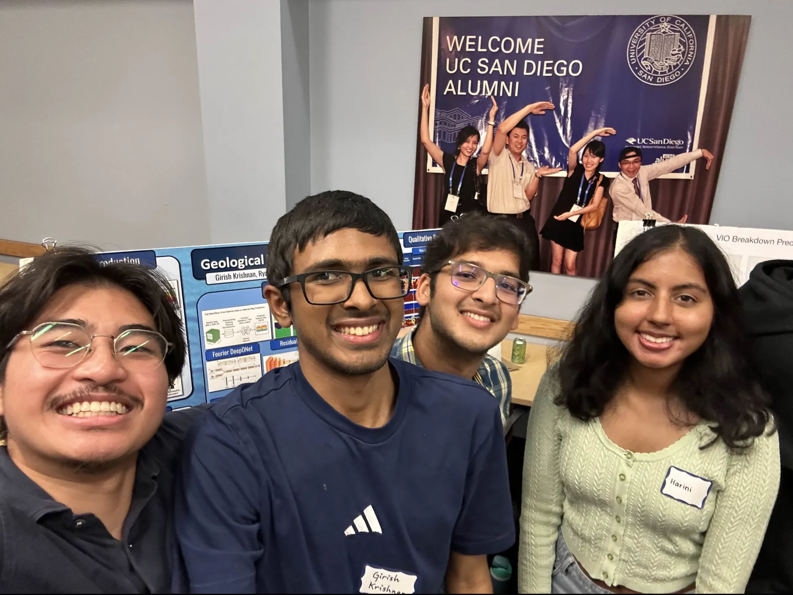

# <center>Physics-Informed Deep Learning for Geological Full Waveform Inversion (FWI)</center>

*<center>Girish Krishnan, Ryan Irwandy, Yash Puneet, Harini Gurusankar</center>*

*<center>ECE 228 Final Project, Spring 2025</center>*

|||
|---|---|

<div style="text-align: center;">
   <a href="https://docs.google.com/presentation/d/1wfly51wmukF_M-mXVlJaRHG03IYZg2LK1fLiKip6Jt8/edit?usp=sharing" target="_blank">
      Click here to view the poster!
   </a>
</div>

---

## Directory Structure

```plaintext
ECE-228-Final-Project/
├── media
├── project_proposal
├── project_report
├── models
   ├── FNO_2D
   ├── FourierDeepONet
   ├── InversionNet
   ├── NeuralODE
   ├── PCA
   ├── ResidualUNet
   ├── VelocityGAN
├── kaggle
├── data_loading.py
```

The `models` directory contains several subdirectories, one for each model used in the project. Each subdirectory contains a `README.md` file that in turn contains a description of the model, its architecture, and how to run it.

The `kaggle` directory contains the code that can be used to make submissions to the Kaggle competition.

## Visualizing the Dataset

To start off, you can download a small sample of the OpenFWI dataset at this link: [OpenFWI Sample Dataset](https://drive.google.com/drive/folders/1xN6Bc58ifY488msIMvQG5F8SZPz7YZrr?usp=sharing).

Then, the script `data_loading.py` can be used to visualize the dataset. The script will load the data and plot the velocity model, source wavelet, and observed data.